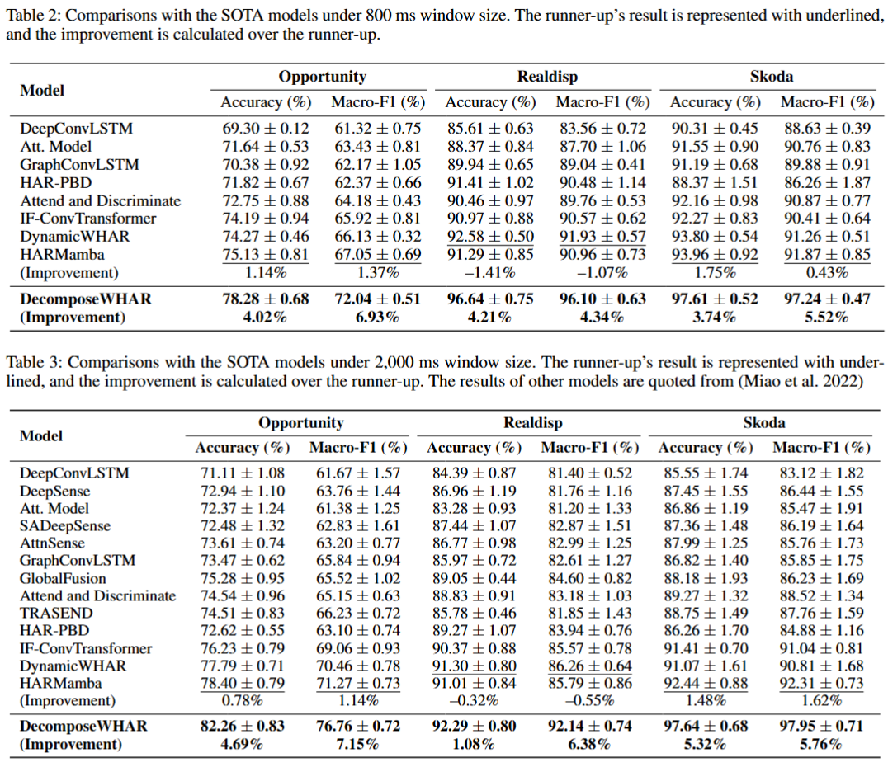

# DecomposeWHAR
The official code for the AAAI 2025😍 paper, titled "Decomposing and Fusing Intra- and Inter-Sensor Spatio-Temporal Signals for Multi-Sensor Wearable Human Activity Recognition."

## 🗺️ Model Overview

## 📄 Experiment Results

❗Note: The experiment condition may not be the same as the baseline model "DynamicWHAR" because we aim to find the most suitable settings for our model to demonstrate the best performance.
Additionally, we can't reproduce the results of their paper in the experiment settings based on their codes, so we just quote results of "DynamicWHAR" and previous models in their paper.

## ⚒️ Prerequisites
- Python: >= 3.8
- Pytorch: >= 2.2.0 + cu118
- Mamba-ssm: 1.2.0
- Causal-conv1d: 1.2.0

## 🔛 Getting Started

1. **Setup**: Ensure that all required dependencies are installed.
2. **Download Dataset**: Download the preprocessed data from the website in the `download.txt` and put the files into the directory structure below.
2. **Run the model**: Modify the args and execute the `main.py` script to start training or evaluating the model.

## 📇 Directory Structure

- **`Dataset`/**: Contains scripts and data for preprocessing and handling datasets used in training and testing the models. Put the preprocessed data into the following directory structure:
  - `opp`/
    - `opp_24_12`/
    - `opp_60_30`/
       ... # preprocessed data of Opportunity
  - `realdisp`/
    - `realdisp_40_20`/
    - `realdisp_100_50`/
       ... # preprocessed data of Realdisp
  - `skoda`/
    - `skoda_right_78_39`/
    - `skoda_right_196_98`/
       ... # preprocessed data of Skoda
  
- **`layers`/**: Includes the core layer implementations used in our model.

- **`models_layers`/**: Contains scripts that define the neural network models, integrating various layers and modules.

- **`utils`/**: Utility functions that support data processing, model training, evaluation, and other common operations.

- **`main.py`**: The main script to run the training and evaluation of the models.

- **`modules.py`**: Defines the main modules of our model.

- **`utils_this.py`**: Additional utility functions.

## 🫰 Acknowledgements
Our work is inspired by the following papers and their open-source codes. We sincerely thank the authors of these works for their contributions.
- **DynamicWHAR**: https://github.com/wdkhuans/DynamicWHAR
- **ModernTCN**: https://github.com/luodhhh/ModernTCN
- **SST**: https://github.com/XiongxiaoXu/SST
- **HARMamba**: https://arxiv.org/abs/2403.20183
- **Time-Series-Library**: https://github.com/thuml/Time-Series-Library

## 👍 Extension  
- **Other Model Layers**: We have experimented with several recent advanced time series classification methods, including TimesNet and various Transformer variants. The code for these methods is stored in the `layers` and `models_layers` directories. For those interested in exploring state-of-the-art models for WHAR, these implementations provide a solid foundation for further improvements.
- **Data Augmentation**: Additionally, employing data augmentation techniques such as "Mixup" and strategies like "Center Loss" can be beneficial in mitigating overfitting and enhancing recognition accuracy.