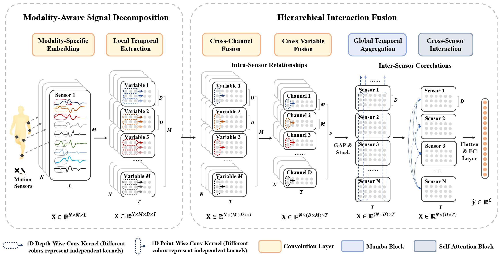

# DecomposeWHAR
The official code for the AAAI 2025 paper😍, titled "Decomposing and Fusing Intra- and Inter-Sensor Spatio-Temporal Signals for Multi-Sensor Wearable Human Activity Recognition."

# Model Overview

## Prerequisites
- Python: >= 3.8
- Pytorch: >= 2.2.0 + cu118
- Mamba-ssm: 1.2.0
- Causal-conv1d: 1.2.0

## Getting Started

1. **Setup**: Ensure that all required dependencies are installed.
2. **Download Dataset**: Download the preprocessed data from the website in the `download.txt` and put the files into the directory structure below.
2. **Run the model**: Execute the `main.py` script to start training or evaluating the model.

## Directory Structure

- **`Dataset`/**: Contains scripts and data for preprocessing and handling datasets used in training and testing the models. Put the preprocessed data into the following directory structure:
  - `opp`/
    - `opp_24_12`/
    - `opp_60_30`/
       ... # preprocessed data of Opportunity
  - `realdisp`/
    - `realdisp_40_20`/
    - `realdisp_100_50`/
       ... # preprocessed data of Realdisp
  - `skoda`/
    - `skoda_right_78_39`/
    - `skoda_right_196_98`/
       ... # preprocessed data of Skoda
  
- **`layers`/**: Includes the core layer implementations used in our model.

- **`models_layers`/**: Contains scripts that define the neural network models, integrating various layers and modules.

- **`utils`/**: Utility functions that support data processing, model training, evaluation, and other common operations.

- **`main.py`**: The main script to run the training and evaluation of the models.

- **`modules.py`**: Defines the main modules of our model.

- **`utils_this.py`**: Additional utility functions.

# Acknowledgements
Our work is inspired by the following papers with their opensourced codes:

1. DynamicWHAR: https://github.com/wdkhuans/DynamicWHAR
2. ModernTCN: https://github.com/luodhhh/ModernTCN
3. SST: https://github.com/XiongxiaoXu/SST
4. HARMamba: https://arxiv.org/abs/2403.20183